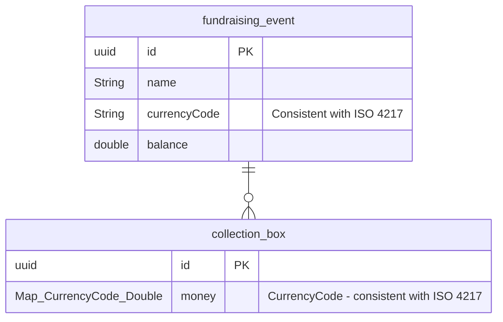

# InternshipTask-CharityBox

## 🚀 How to run

1. **Create .env file and complete content**

    ```
    API_KEY=
    ```

    >  **How to get API_KEY?** You can Generate api key here: [https://www.exchangerate-api.com/](https://www.exchangerate-api.com/)

2. **Navigate to the main directory**
    ```bash
    cd InernhshipTaks-Charity
    ```

3. **Run docker**

    ```bash
    docker compose up --build
    ```
   
## Database Schema

