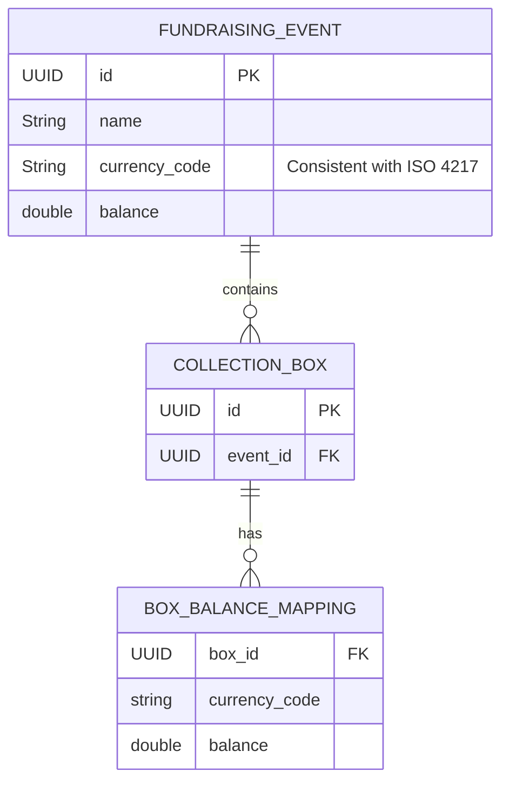

# InternshipTask-CharityBox

Simple API managing collection boxes during fundraising events for charity organizations. The Web API was created using Spring Boot and follows the **REST architectural style**. The application is built with **Java 24**, **Hibernate** for ORM, **Maven** for dependency management, and **H2** as an in-memory database. The project  is located in the [`server`](https://github.com/WajHub/InternshipTask-CharityBox/tree/main/server).

For testing, I used **JUnit 5** and **Mockito** for Unit Tests and **MockMvc** for Integration Tests to simulate HTTP requests and verify the behavior of the API. The project also integrates an external API to fetch exchange rates from  [`https://www.exchangerate-api.com/`](https://www.exchangerate-api.com/).

- [How to run](#how-to-run)
- [How to run test](#how-to-run-tests)
- [Endpoints](#endpoints)
- [Schema Database](#Schema-Database)


## How to run

1. **Create .env file in the `server/src/main/resources/`  and complete content**

    ```
    API_KEY=
    ```

    >  **How to get API_KEY?** You can Generate api key here: [`https://www.exchangerate-api.com/`](https://www.exchangerate-api.com/)

2. **With Docker**
   - **Navigate to the main directory**
    ```bash
    cd InernhshipTaks-Charity
    ```
   - **Run docker**

    ```bash
    docker compose up --build
    ```

3. **Without Docker**
   - **Navigate to the main directory**
    ```bash
    cd InernhshipTaks-Charity/server
    ```
   - **Run Spring boot Application**

    ```bash
    ./mvnw spring-boot:run
    ```

The Swagger UI will be available at: [`http://localhost:8080/swagger-ui/index.html`](http://localhost:8080/swagger-ui/index.html)

## How to run tests

1. **Navigate to the main directory**

   ```bash
   cd InernhshipTaks-Charity/server
    ```
   
   - All tests
   ```bash
   ./mvnw test
    ```
   
   - Only unit tests
   ```bash
    ./mvnw -Dtest='*UnitTests' test
    ```

   - Only integration tests
   ```bash
    ./mvnw -Dtest='*IntegrationTests' test

    ```
   
Tests are located in [`tests`](https://github.com/WajHub/InternshipTask-CharityBox/tree/main/server/src/test).

## Endpoints

   - `GET /api/v1/events` - **Display a financial report with all fundraising events and the sum of their accounts.**

      <details>
         <summary>Example Query
         </summary>...
      </details>
     
      <details>
         <summary>Example Response
         </summary>...
      </details>

   - `POST /api/v1/events` - **Create a new fundraising event.**

      <details>
         <summary>Example Query
         </summary>...
      </details>

      <details>
         <summary>Example Response
         </summary>...
      </details>

   - `PUT /api/v1/events/{uuid}` - Create a new fundraising event with provided UUId to simplify testing.

      <details>
         <summary>Example Query
         </summary>...
      </details>

      <details>
         <summary>Example Response
         </summary>...
      </details>

   - `GET /api/v1/collections` - **List all collection boxes. Include information if the box is assigned (but don’t expose to what
     fundraising event) and if it is empty or not (but don’t expose the actual value in the box).**

      <details>
         <summary>Example Query
         </summary>...
      </details>

      <details>
         <summary>Example Response
         </summary>...
      </details>
     
   - `POST /api/v1/collections` - **Create new collection box.**

      <details>
         <summary>Example Query
         </summary>...
      </details>

      <details>
         <summary>Example Response
         </summary>...
      </details>

   - `PUT /api/v1/collections/{uuid}` - Create new collection box  with provided UUId to simplify testing.

     <details>
        <summary>Example Query
        </summary>...
     </details>

     <details>
        <summary>Example Response
        </summary>...
     </details>

   - `PATCH /api/v1/collections/{uuid}` - **Put (add) some money inside the collection box.**

     <details>
        <summary>Example Query
        </summary>...
     </details>

     <details>
        <summary>Example Response
        </summary>...
     </details>

   - `PATCH /api/v1/events/{eventUuid}/collections/{collectionUuid}/register` - **Assign the collection box to an existing fundraising event.**

     <details>
        <summary>Example Query
        </summary>...
     </details>

     <details>
        <summary>Example Response
        </summary>...
     </details>

   - `DELETE /api/v1/collections/{uuid}` - **Unregister (remove) a collection box (e.g. in case it was damaged or stolen).**

     <details>
        <summary>Example Query
        </summary>...
     </details>

     <details>
        <summary>Example Response
        </summary>...
     </details>

   - `PATCH /api/v1/collections/{uuid}/transfer` - **Empty the collection box i.e. “transfer” money from the box to the fundraising event’s account.**

     <details>
        <summary>Example Query
        </summary>...
     </details>

     <details>
        <summary>Example Response
        </summary>...
     </details>


## Schema Database

